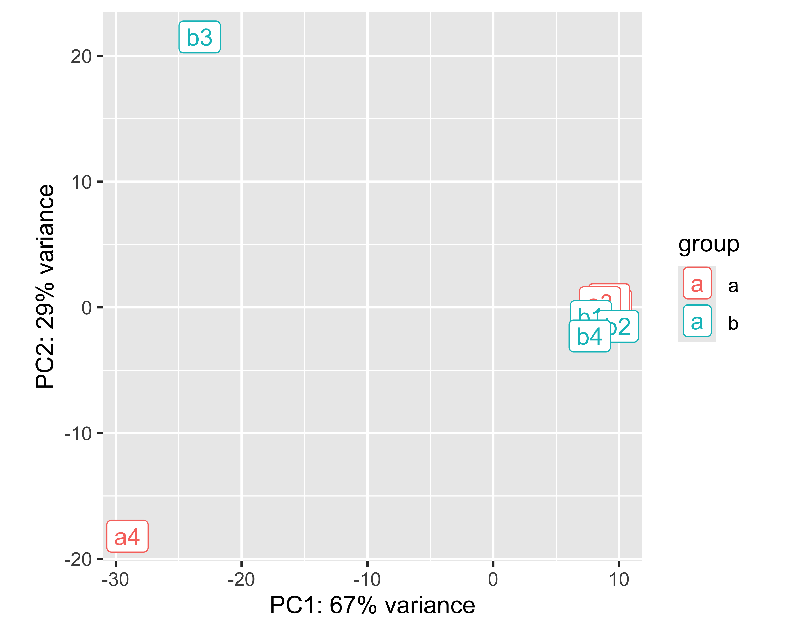
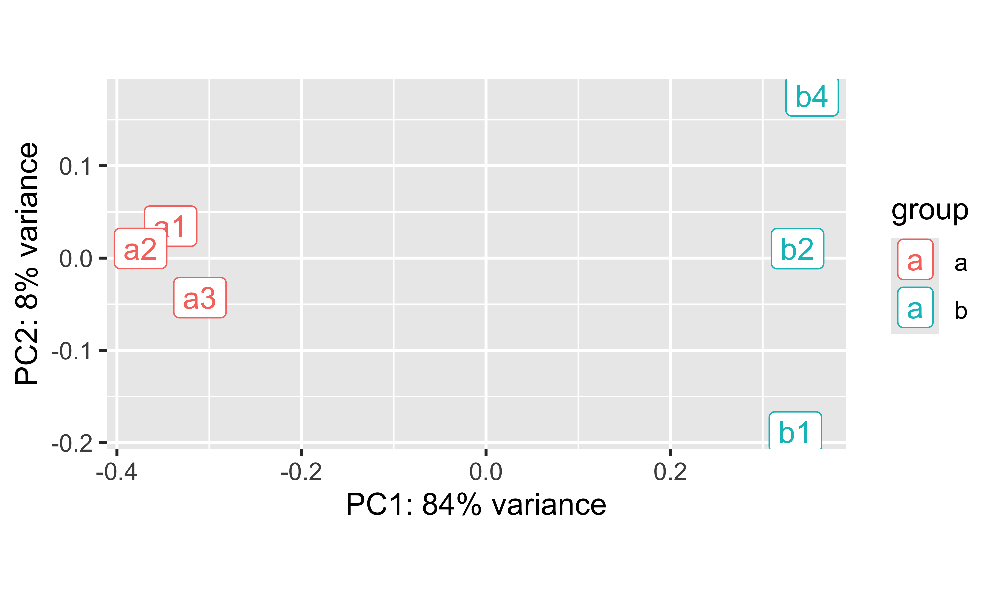
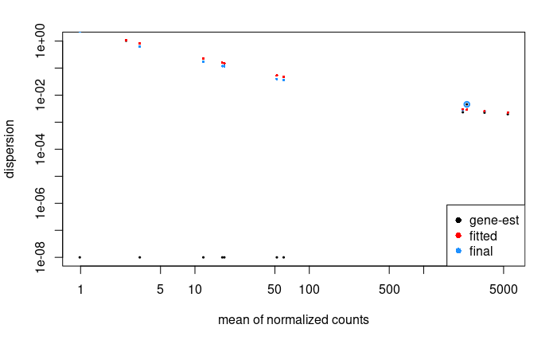
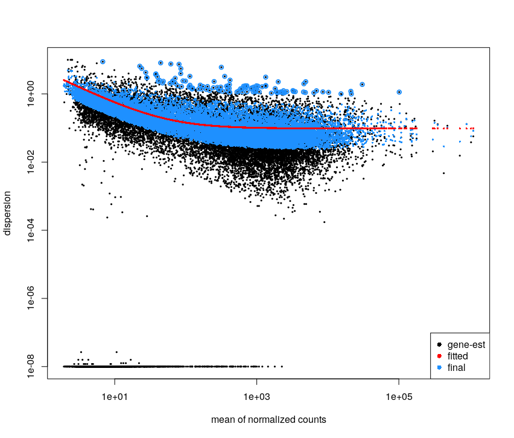
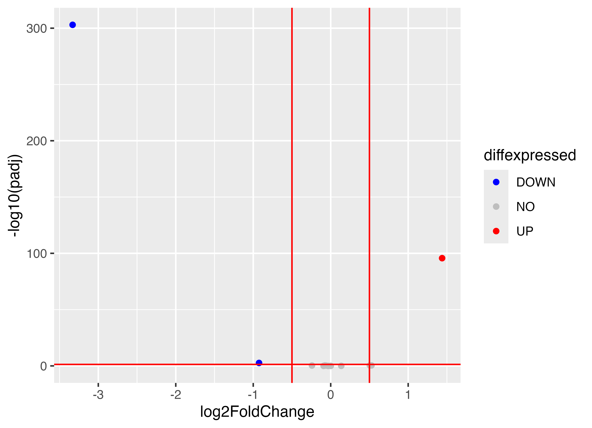
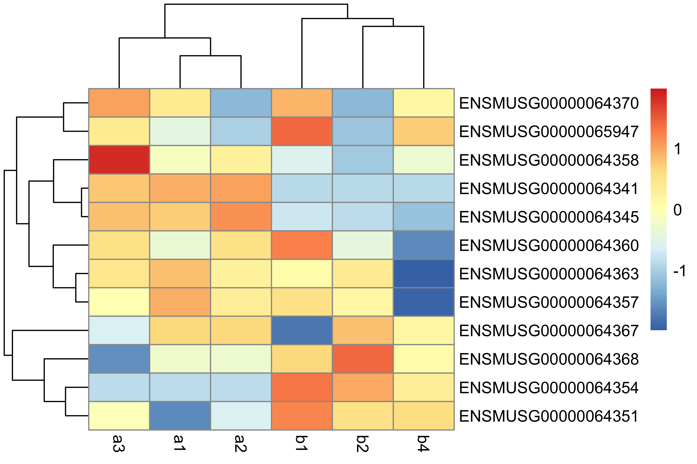

Once the reads have been mapped and counted, one can assess the differential expression of genes between different conditions.


**During this lesson, you will learn to :**

 * describe the different steps of data normalization and modelling commonly used for RNA-seq data.
 * detect significantly differentially-expressed genes using DESeq2.


## Material

<!-- [:fontawesome-solid-file-pdf: Download the presentation](../assets/pdf/RNA-Seq_06_DE.pdf){target=_blank : .md-button } -->

[Rstudio website](https://www.rstudio.com/)
<!-- Suggestion: RStudio reminders ??? Or link to some course or something? -->
<!-- Perhaps this one? https://www.datacamp.com/tutorial/r-studio-tutorial -->


[DESeq2 vignette](https://bioconductor.org/packages/release/bioc/vignettes/DESeq2/inst/doc/DESeq2.html){target=_blank : .md-button }


## Download packages in Rstudio 


The analysis of the read count data will be done on an RStudio instance, using the R language and some relevant [Bioconductor](http://bioconductor.org/) libraries.

```r
install.packages("tidyverse")
install.packages("pheatmap")

if (!requireNamespace("BiocManager", quietly = TRUE)) {
    install.packages("BiocManager")
}
BiocManager::install("DESeq2")
BiocManager::install("apeglm")
BiocManager::install("clusterProfiler")
BiocManager::install("org.Mm.eg.db")
BiocManager::install("ReactomePA")
```


## Differential Expression Inference

Let's analyze the `mouseMT` toy dataset.


To help you get started, here is the code to load the reads counts into R as a count matrix:


```r

# we skip the first line, which contains metadata

df <- read.csv("051_r_featureCounts_mouseMT.counts.extraAttributes.txt", sep = "\t", skip = 1)

head(df)
names(df)
```

<!-- ```
					V2		V3		V4
ENSMUSG00000064336	0		0		0	
ENSMUSG00000064337	0		0		0	
ENSMUSG00000064338	0		0		0	
ENSMUSG00000064339	0		0		0	
ENSMUSG00000064340	0		0		0	
ENSMUSG00000064341	4046	1991	2055	
``` -->

We have gene information and count information. We need to be able to easily access our counts and rename our sample columns for easier use. 

```r
idx.num <- 14:21
sample_names <- c("a1", "a2", "a3", "a4", "b1", "b2", "b3", "b4")
cbind(names(df[idx.num]), sample_names)
colnames(df)[idx.num] <- sample_names
names(df)
```
<!-- ```
					a1		a2		a3		a4	b1	b2	b3	b4
ENSMUSG00000064336	0		0		0		0	0	0	0	0
ENSMUSG00000064337	0		0		0		0	0	0	0	0
ENSMUSG00000064338	0		0		0		0	0	0	0	0
ENSMUSG00000064339	0		0		0		2	0	0	0	0
ENSMUSG00000064340	0		0		0		0	0	0	0	0
ENSMUSG00000064341	4046	4098	4031	1	449	515	13	456
``` -->


??? success "DESeq2 analysis"

	```r
	library(DESeq2)
	library(tidyverse)
	library(pheatmap)
	library(apeglm)
	```

	Filter low count genes. 

	Here, we will apply a very soft filter and keep genes with at least 1 read in at least 4 samples (size of the smallest group). We would normally keep genes with at least 10 reads in one group. 

	```r
	GroupSize <- 4
	minReads <- 1

	keep <- rowSums(df[,idx.num] >= minReads) >= GroupSize

	filtered_df <- df[keep, ]

	```
	<!-- ```
	[1] 13  8
	``` -->


	## setting up the experimental design

	```r
	#note: levels let's us define the reference levels
	treatment <- factor( c(rep("a",4), rep("b",4)), levels=c("a", "b") )
	colData <- data.frame(treatment, row.names = colnames(filtered_df)[idx.num])
	colData
	```
 
	```
		treatment
	a1	a			
	a2	a			
	a3	a			
	a4	a			
	b1	b			
	b2	b			
	b3	b			
	b4	b
	```

	## create matrix of counts

	```r
	numM <- filtered_df[,idx.num]
	rownames(numM) <- filtered_df$Geneid

	```


	## creating the DESeq data object and some QC

	```r
	dds <- DESeqDataSetFromMatrix(
	  countData = numM, colData = colData, 
	  design = ~ treatment)
	dim(dds)
	```


	We perform the estimation of dispersions 
	```r
	dds <- DESeq(dds)
	```
	```
	estimating size factors
	estimating dispersions
	gene-wise dispersion estimates
	mean-dispersion relationship
	-- note: fitType='parametric', but the dispersion trend was not well captured by the
	   function: y = a/x + b, and a local regression fit was automatically substituted.
	   specify fitType='local' or 'mean' to avoid this message next time.
	final dispersion estimates
	fitting model and testing
	```

	PCA plot of the samples:
	```r
	vsd <- varianceStabilizingTransformation(dds)
	pcaData <- plotPCA(vsd, intgroup=c("treatment"))
	pcaData + geom_label(aes(x=PC1,y=PC2,label=name))
	```

	
	

	OK, so a4 and b3 are quite different from the rest.

	 * a4 was expected from the QC
	 * b3 we did not expect until now

	If we did the analysis with them, here is what we get:
	```r
	res <- results(dds)
	summary(res)
	```
	```
	out of 13 with nonzero total read count
	adjusted p-value < 0.1
	LFC > 0 (up)       : 0, 0%
	LFC < 0 (down)     : 0, 0%
	outliers [1]       : 6, 46%
	low counts [2]     : 0, 0%
	(mean count < 14)
	[1] see 'cooksCutoff' argument of ?results
	[2] see 'independentFiltering' argument of ?results

	```

	So, let's eliminate these two samples.

	## analysis without the outliers

	```r
	# Start with original dataset
	df_noOutliers = df[ , !( colnames(df) %in% c('a4','b3') ) ]
	names(df_noOutliers)

	idx.num <- 14:19

	# Filter again
	GroupSize <- 3
	minReads <- 1

	keep <- rowSums(df_noOutliers[,idx.num] >= minReads) >= GroupSize

	filtered_df_noOutliers <- df_noOutliers[keep, ]

	numM_noOutliers <- filtered_df_noOutliers[,idx.num]
	rownames(numM_noOutliers) <- filtered_df_noOutliers$Geneid

	treatment <- factor( c(rep("a",3), rep("b",3)), levels=c("a", "b") )
	colData <- data.frame(treatment, row.names = colnames(numM_noOutliers))
	colData 


	dds <- DESeqDataSetFromMatrix(
  		countData = numM_noOutliers, colData = colData, 
  		design = ~ treatment)
	dim(dds)

	dds <- DESeq(dds)

	vsd <- varianceStabilizingTransformation(dds)
	pcaData <- plotPCA(vsd, intgroup=c("treatment"))
	pcaData + geom_label(aes(x=PC1,y=PC2,label=name))


	```
 
	

	It looks much better. Seems like PC1 captures the group effect


	<!-- We plot the estimate of the dispersions
	```r
	# * black dot : raw
	# * red dot : local trend
	# * blue : corrected
	plotDispEsts(dds)
	```

	

	There is so few genes that this does not look super nice here

	For the Ruhland2016 dataset it looks like:

	

	This plot is not easy to interpret. It represents the amount of dispersion at different levels of expression. It is directly linked to our ability to detect differential expression.

	Here it looks about normal compared to typical bulk RNA-seq experiments : the dispersion is comparatively larger for lowly-expressed genes. -->


	```r
	# extracting results for the treatment versus control contrast
	res <- results(dds)
	summary(res)
	```
	<!-- ```
	out of 12 with nonzero total read count
	adjusted p-value < 0.1
	LFC > 0 (up)       : 1, 8.3%
	LFC < 0 (down)     : 2, 17%
	outliers [1]       : 0, 0%
	low counts [2]     : 0, 0%
	(mean count < 1)
	[1] see 'cooksCutoff' argument of ?results
	[2] see 'independentFiltering' argument of ?results
	``` -->

	We can have a look at the coefficients of this model
	```r
	head(coef(dds)) # the second column corresponds to the difference between the 2 conditions
	```
	```
	                   Intercept treatment_b_vs_a
	ENSMUSG00000064341 12.084282      -3.33601412
	ENSMUSG00000064345  6.112479      -0.99101369
	ENSMUSG00000064351  3.757967       0.64546475
	ENSMUSG00000064354 10.209339       1.44160442
	ENSMUSG00000064357 11.763707      -0.06245774
	ENSMUSG00000064358  6.026334      -0.26447858
	```

	Here, it contains an intercept and a coefficient for the difference between the two groups.

	Volcano Plot:

	```r
	res.lfc <- lfcShrink(dds, coef=2, res=res)
	
	FDRthreshold = 0.05
	logFCthreshold = 0.5
	# add a column of NAs
	res.lfc$diffexpressed <- "NO"
	# if log2Foldchange > 0.5 and pvalue < 0.05, set as "UP" 
	res.lfc$diffexpressed[res.lfc$log2FoldChange > logFCthreshold & res.lfc$padj < FDRthreshold] <- "UP"
	# if log2Foldchange < 0.5 and pvalue < 0.05, set as "DOWN"
	res.lfc$diffexpressed[res.lfc$log2FoldChange < -logFCthreshold & res.lfc$padj < FDRthreshold] <- "DOWN"

	ggplot(data = data.frame(res.lfc) , aes(x=log2FoldChange , y = -log10(padj) , col =diffexpressed)) + 
	  geom_point() + 
	  geom_vline(xintercept=c(-logFCthreshold, logFCthreshold), col="red") +
	  geom_hline(yintercept=-log10(FDRthreshold), col="red") +
	  scale_color_manual(values=c("blue", "grey", "red"))

	table(res.lfc$diffexpressed)
	```
	```
	DOWN   NO   UP 
	   3   9    1 
	```
	


	Heatmap:
	```r
	vsd.counts <- assay(vsd)

	topVarGenes <- head(order(rowVars(vsd.counts), decreasing = TRUE), 20)
	mat  <- vsd.counts[ topVarGenes, ] #scaled counts of the top genes
	pheatmap(mat,
         scale = "row")
	```
	

	## saving results to file

	note: a CSV file can be imported into Excel
	```r
	master <- cbind(filtered_df_noOutliers, res)
	write.csv(master, file = "051_r_mouseMT.DESeq2.results.csv", row.names = FALSE)

	```


!!! note "From ensembl gene ids to gene names"

	We can convert between different gene ids using the `bitr` function from `clusterProfiler`
	```r
	library(clusterProfiler)
	library(org.Mm.eg.db)

	allGenes <- master$Geneid

	genes_universe <- bitr(allGenes, fromType = "ENSEMBL",
                       	toType = c("ENTREZID", "SYMBOL"),
                       	OrgDb = "org.Mm.eg.db")
	genes_universe
	```
	```
	              ENSEMBL ENTREZID  SYMBOL
1  ENSMUSG00000064341    17716  mt-Nd1
2  ENSMUSG00000064345    17717  mt-Nd2
3  ENSMUSG00000064351    17708  mt-Co1
4  ENSMUSG00000064354    17709  mt-Co2
5  ENSMUSG00000064356    17706 mt-Atp8
6  ENSMUSG00000064357    17705 mt-Atp6
7  ENSMUSG00000064358    17710  mt-Co3
8  ENSMUSG00000064360    17718  mt-Nd3
9  ENSMUSG00000065947    17720 mt-Nd4l
10 ENSMUSG00000064363    17719  mt-Nd4
11 ENSMUSG00000064367    17721  mt-Nd5
12 ENSMUSG00000064368    17722  mt-Nd6
13 ENSMUSG00000064370    17711 mt-Cytb
	```

	> Here is the list of [orgDb packages](https://bioconductor.org/packages/release/BiocViews.html#___OrgDb). For non-model organisms it will be more complex.


## Differential Expression - Task

Use DESeq2 to conduct a differential expression analysis on the Ruhland dataset.


### Ruhland2016 - DESeq2 correction

[DESeq2 vignette](https://bioconductor.org/packages/release/bioc/vignettes/DESeq2/inst/doc/DESeq2.html){target=_blank : .md-button }

??? success "read in the data"

	```R
	library(tidyverse)
	library(DESeq2)
	library(ggplot2)
	library(pheatmap)
	library(apeglm)

	# reading the counts files - adapt the file path to your situation
	df <- read.csv("052_r_featureCounts_trimmed_Ruhland.counts.extraAttributes.txt", sep = "\t", skip = 1)
	head(df)
	names(df)

	# renaming the sample columns for easier use
	idx.num <- 14:19
	sample_names <- c("EtOH_1", "EtOH_2", "EtOH_3", "TAM_1", "TAM_2", "TAM_3")
	cbind(names(df[idx.num]), sample_names)
	colnames(df)[idx.num] <- sample_names
	names(df)
	```

	This `extraAttributes` counts file also carries gene annotation columns (e.g. `gene_biotype`), which we will use for filtering next.

??? success "preprocessing - filtering by biotype and low counts"

	```R
	dim(df)
	table(df$gene_biotype)

	# Remove extra variance by subsetting for protein_coding genes only
	keep_gene <- which(df$gene_biotype == 'protein_coding')
	df2 <- df[keep_gene, ]

	dim(df2)
	```

	Take note of how many genes you start with, and how many remain once non-protein-coding genes (e.g. `lncRNA`, pseudogenes, ...) are removed.

	```R
	# Filter by low count
	GroupSize <- 3
	minReads <- 10

	keep <- rowSums(df2[,idx.num] >= minReads) >= GroupSize

	filtered_df <- df2[keep, ]
	```

	Compare `dim(filtered_df)` to `dim(df2)`: how many genes pass this minimum-expression filter?

??? success "experimental design and DESeq object"

	```R
	#note: levels let's us define the reference levels
	treatment <- factor( c(rep("EtOH",3), rep("TAM",3)), levels=c("EtOH", "TAM") )
	colData <- data.frame(treatment, row.names = colnames(filtered_df)[idx.num])
	colData

	numM <- filtered_df[,idx.num]
	rownames(numM) <- filtered_df$Geneid

	dds <- DESeqDataSetFromMatrix(
	  countData = numM, colData = colData, 
	  design = ~ treatment)
	dim(dds)

	dds <- DESeq(dds)
	```

??? success "PCA and detecting outlier genes"

	```R
	vsd <- varianceStabilizingTransformation(dds)
	pcaData <- plotPCA(vsd, intgroup=c("treatment"))
	pcaData + geom_label(aes(x=PC1,y=PC2,label=name))

	res <- results(dds)
	summary(res)
	```

	Look at the PCA plot: do samples separate by `treatment` along PC1? Also check `summary(res)` - a notable number of genes are flagged as `outliers`

	```R
	# What to do with outliers?
	outlier <- which(is.na(res$padj))

	pheatmap::pheatmap(assay(vsd)[outlier,],
	                   show_rownames = TRUE,
	                   scale = "row")  
	```

	Genes with `NA` adjusted p-values are flagged by DESeq2's Cook's distance outlier detection. The heatmap of their scaled expression can help you confirm whether these genes are driven by a single aberrant sample. 

??? success "removing outlier genes and re-running DESeq2"

	```R
	# Remove outliers
	filtered_df_noOutliers <- filtered_df[-outlier, ]

	numM <- filtered_df_noOutliers[,idx.num]
	rownames(numM) <- filtered_df_noOutliers$Geneid

	dds <- DESeqDataSetFromMatrix(
	  countData = numM, colData = colData, 
	  design = ~ treatment)
	dim(dds)

	dds <- DESeq(dds)

	vsd <- varianceStabilizingTransformation(dds)
	pcaData <- plotPCA(vsd, intgroup=c("treatment"))
	pcaData + geom_label(aes(x=PC1,y=PC2,label=name))

	res <- results(dds)
	summary(res)
	```

	Compare this new PCA plot and the new `summary(res)` output to the previous ones: after removing the outlier genes, the `outliers` category reported by DESeq2 should shrink (or disappear), and the sample clustering on the PCA should look cleaner.

??? success "coefficients and volcano plot"

	```R
	head(coef(dds)) # the second column corresponds to the difference between the 2 conditions

	FDRthreshold = 0.05
	logFCthreshold = 1

	res.lfc <- lfcShrink(dds, coef=2, res=res)

	# add a column of NAs
	res.lfc$diffexpressed <- "NO"
	# if log2Foldchange > 1 and padj < 0.05, set as "UP" 
	res.lfc$diffexpressed[res.lfc$log2FoldChange > logFCthreshold & res.lfc$padj < FDRthreshold] <- "UP"
	# if log2Foldchange < -1 and padj < 0.05, set as "DOWN"
	res.lfc$diffexpressed[res.lfc$log2FoldChange < -logFCthreshold & res.lfc$padj < FDRthreshold] <- "DOWN"

	ggplot( data = data.frame( res.lfc ) , aes( x=log2FoldChange , y = -log10(padj) , col =diffexpressed ) ) + 
	  geom_point() + 
	  geom_vline(xintercept=c(-logFCthreshold, logFCthreshold), col="red") +
	  geom_hline(yintercept=-log10(FDRthreshold), col="red") +
	  scale_color_manual(values=c("blue", "grey", "red"))

	table(res.lfc$diffexpressed)
	```

	How many genes are called `UP` and `DOWN` at this threshold?

??? success "heatmap of top variable genes"

	```R
	vsd.counts <- assay(vsd)

	topVarGenes <- head(order(rowVars(vsd.counts), decreasing = TRUE), 20)
	mat  <- vsd.counts[ topVarGenes, ] #scaled counts of the top genes
	pheatmap(mat,
	         scale = "row")
	```

??? success "saving results to file"

	```R
	# note: a CSV file can be imported into Excel
	master <- cbind(filtered_df_noOutliers, res)
	write.csv(master, file = "051_r_Ruhland.DESeq2.results.csv", row.names = FALSE)
	```

