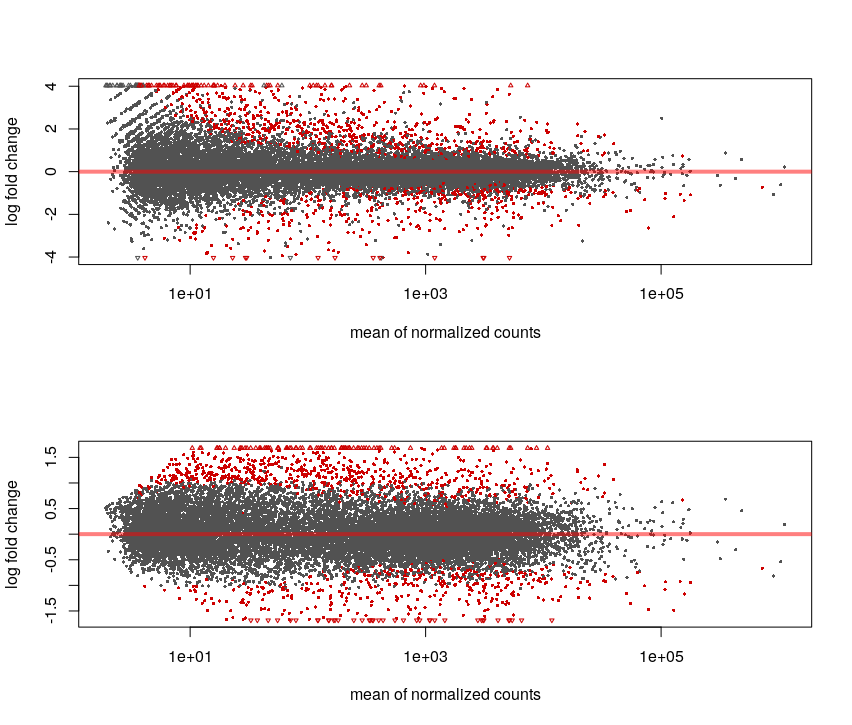
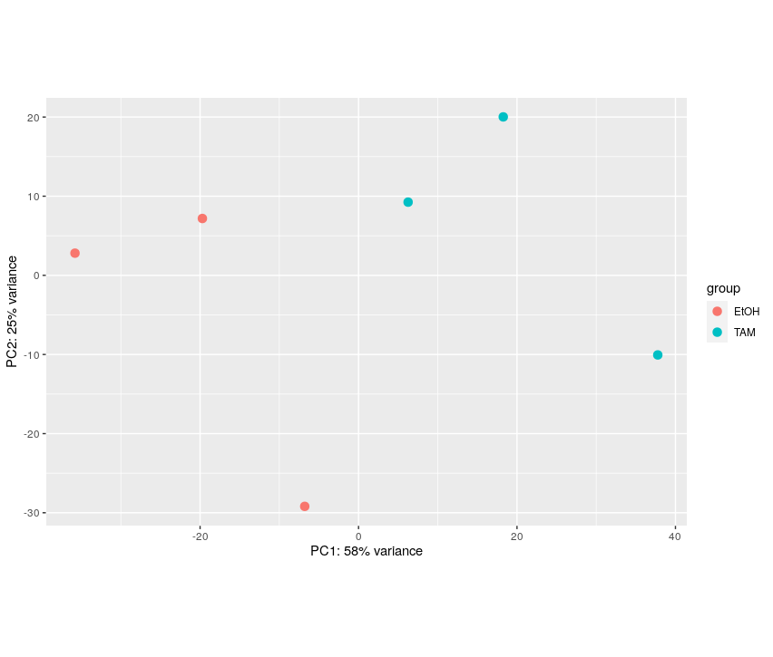
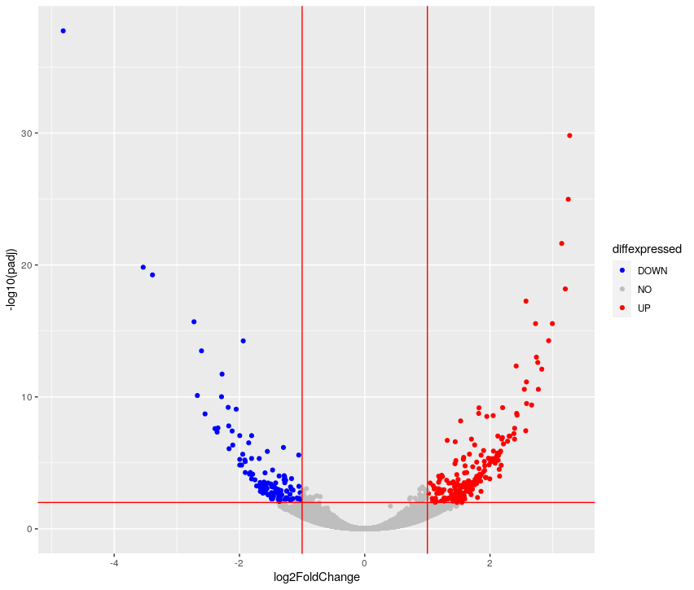
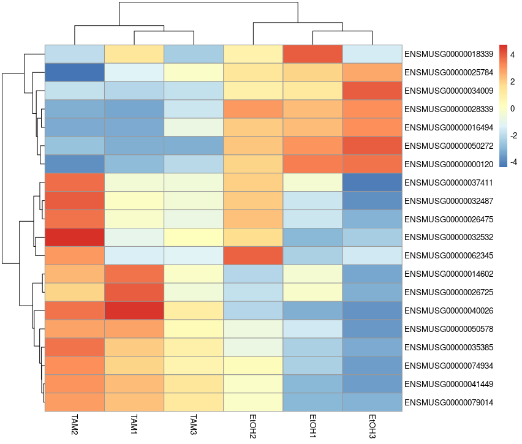
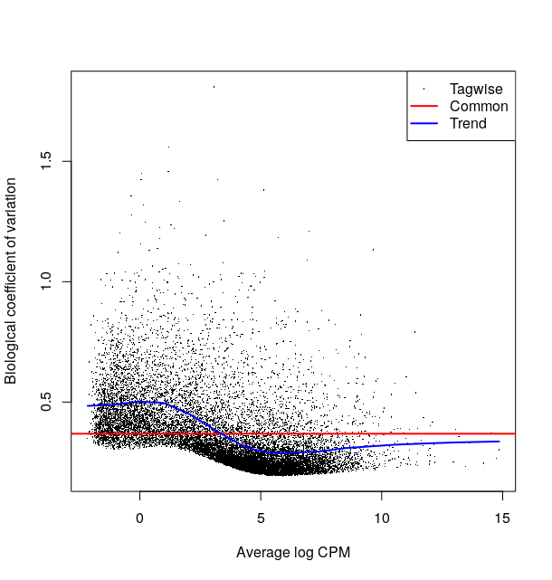
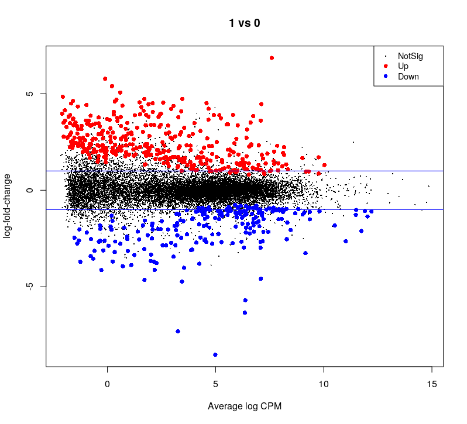
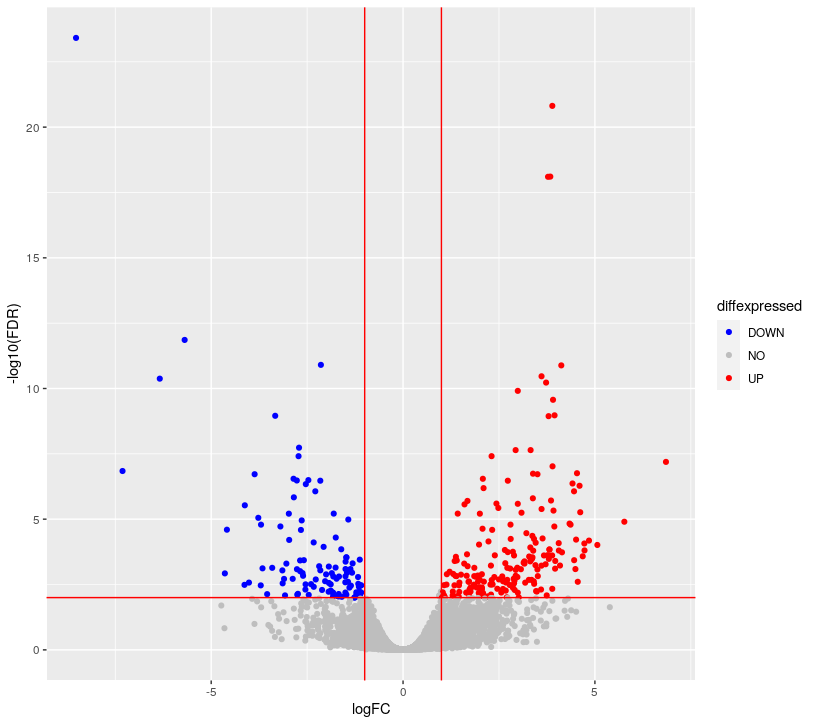
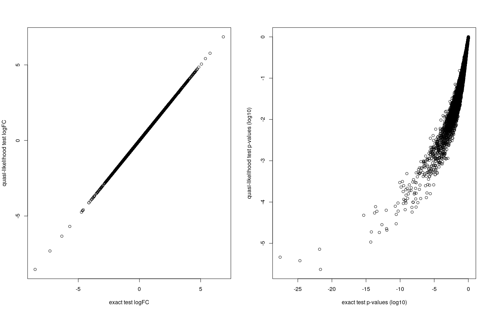

Once the reads have been mapped and counted, one can assess the differential expression of genes between different conditions.


**During this lesson, you will learn to :**

 * describe the different steps of data normalization and modelling commonly used for RNA-seq data.
 * detect significantly differentially-expressed genes using DESeq2.


## Material

[:fontawesome-solid-file-pdf: Download the presentation](../assets/pdf/RNA-Seq_06_DE.pdf){target=_blank : .md-button }

[Rstudio website](https://www.rstudio.com/)
<!-- Suggestion: RStudio reminders ??? Or link to some course or something? -->
<!-- Perhaps this one? https://www.datacamp.com/tutorial/r-studio-tutorial -->


[DESeq2 vignette](https://bioconductor.org/packages/release/bioc/vignettes/DESeq2/inst/doc/DESeq2.html){target=_blank : .md-button }


## Download packages in Rstudio 


The analysis of the read count data will be done on an RStudio instance, using the R language and some relevant [Bioconductor](http://bioconductor.org/) libraries.

```r
install.packages("tidyverse")
install.packages("pheatmap")

if (!requireNamespace("BiocManager", quietly = TRUE)) {
    install.packages("BiocManager")
}
BiocManager::install("DESeq2")
BiocManager::install("apeglm")
BiocManager::install("clusterProfiler")
BiocManager::install("org.Mm.eg.db")
```


## Differential Expression Inference

Let's analyze the `mouseMT` toy dataset.


To help you get started, here is the code to load the reads counts into R as a count matrix:


```r

# we skip the first line, which contains metadata

df <- read.csv("051_r_featureCounts_mouseMT.counts.extraAttributes.txt", sep = "\t", skip = 1)

head(df)
names(df)
```

<!-- ```
					V2		V3		V4
ENSMUSG00000064336	0		0		0	
ENSMUSG00000064337	0		0		0	
ENSMUSG00000064338	0		0		0	
ENSMUSG00000064339	0		0		0	
ENSMUSG00000064340	0		0		0	
ENSMUSG00000064341	4046	1991	2055	
``` -->

We have gene information and count information. We need to be able to easily access our counts and rename our sample columns for easier use. 

```r
idx.num <- 14:21
sample_names <- c("a1", "a2", "a3", "a4", "b1", "b2", "b3", "b4")
cbind(names(df[idx.num]), sample_names)
colnames(df)[idx.num] <- sample_names
names(df)
```
<!-- ```
					a1		a2		a3		a4	b1	b2	b3	b4
ENSMUSG00000064336	0		0		0		0	0	0	0	0
ENSMUSG00000064337	0		0		0		0	0	0	0	0
ENSMUSG00000064338	0		0		0		0	0	0	0	0
ENSMUSG00000064339	0		0		0		2	0	0	0	0
ENSMUSG00000064340	0		0		0		0	0	0	0	0
ENSMUSG00000064341	4046	4098	4031	1	449	515	13	456
``` -->


??? success "DESeq2 analysis"

	```r
	library(DESeq2)
	library(tidyverse)
	library(pheatmap)
	library(apeglm)
	```

	Filter low count genes. 

	Here, we will apply a very soft filter and keep genes with at least 1 read in at least 4 samples (size of the smallest group). We would normally keep genes with at least 10 reads in one group. 

	```r
	GroupSize <- 4
	minReads <- 1

	keep <- rowSums(df[,idx.num] >= minReads) >= GroupSize

	filtered_df <- df[keep, ]

	```
	<!-- ```
	[1] 13  8
	``` -->


	## setting up the experimental design

	```r
	#note: levels let's us define the reference levels
	treatment <- factor( c(rep("a",4), rep("b",4)), levels=c("a", "b") )
	colData <- data.frame(treatment, row.names = colnames(filtered_df)[idx.num])
	colData
	```
 
	```
		treatment
	a1	a			
	a2	a			
	a3	a			
	a4	a			
	b1	b			
	b2	b			
	b3	b			
	b4	b
	```

	## create matrix of counts

	```r
	numM <- filtered_df[,idx.num]
	rownames(numM) <- filtered_df$Geneid

	```


	## creating the DESeq data object and some QC

	```r
	dds <- DESeqDataSetFromMatrix(
	  countData = numM, colData = colData, 
	  design = ~ treatment)
	dim(dds)
	```
	<!-- ```
	[1] 37  8
	``` -->


	We perform the estimation of dispersions 
	```r
	dds <- DESeq(dds)
	```
	```
	estimating size factors
	estimating dispersions
	gene-wise dispersion estimates
	mean-dispersion relationship
	-- note: fitType='parametric', but the dispersion trend was not well captured by the
	   function: y = a/x + b, and a local regression fit was automatically substituted.
	   specify fitType='local' or 'mean' to avoid this message next time.
	final dispersion estimates
	fitting model and testing
	```

	PCA plot of the samples:
	```r
	vsd <- varianceStabilizingTransformation(dds)
	pcaData <- plotPCA(vsd, intgroup=c("treatment"))
	pcaData + geom_label(aes(x=PC1,y=PC2,label=name))
	```

	
	

	OK, so a4 and b3 are quite different from the rest.

	 * a4 was expected from the QC
	 * b3 we did not expect until now

	If we did the analysis with them, here is what we get:
	```r
	res <- results(dds)
	summary(res)
	```
	```
	out of 13 with nonzero total read count
	adjusted p-value < 0.1
	LFC > 0 (up)       : 0, 0%
	LFC < 0 (down)     : 0, 0%
	outliers [1]       : 6, 46%
	low counts [2]     : 0, 0%
	(mean count < 14)
	[1] see 'cooksCutoff' argument of ?results
	[2] see 'independentFiltering' argument of ?results

	```

	So, let's eliminate these two samples.

	## analysis without the outliers

	```r
	# Start with original dataset
	df_noOutliers = df[ , !( colnames(df) %in% c('a4','b3') ) ]
	names(df_noOutliers)

	idx.num <- 14:19

	# Filter again
	GroupSize <- 3
	minReads <- 1

	keep <- rowSums(df_noOutliers[,idx.num] >= minReads) >= GroupSize

	filtered_df_noOutliers <- df_noOutliers[keep, ]

	treatment <- factor( c(rep("a",3), rep("b",3)), levels=c("a", "b") )
	colData <- data.frame(treatment, row.names = colnames(numM_noOutliers))
	colData 

	numM_noOutliers <- filtered_df_noOutliers[,idx.num]
	rownames(numM_noOutliers) <- filtered_df_noOutliers$Geneid


	dds <- DESeqDataSetFromMatrix(
  		countData = numM_noOutliers, colData = colData, 
  		design = ~ treatment)
	dim(dds)

	dds <- DESeq(dds)

	vsd <- varianceStabilizingTransformation(dds,)
	pcaData <- plotPCA(vsd, intgroup=c("treatment"))
	pcaData + geom_label(aes(x=PC1,y=PC2,label=name))


	```
 
	

	It looks much better. Seems like PC1 captures the group effect


	<!-- We plot the estimate of the dispersions
	```r
	# * black dot : raw
	# * red dot : local trend
	# * blue : corrected
	plotDispEsts(dds)
	```

	

	There is so few genes that this does not look super nice here

	For the Ruhland2016 dataset it looks like:

	

	This plot is not easy to interpret. It represents the amount of dispersion at different levels of expression. It is directly linked to our ability to detect differential expression.

	Here it looks about normal compared to typical bulk RNA-seq experiments : the dispersion is comparatively larger for lowly-expressed genes. -->


	```r
	# extracting results for the treatment versus control contrast
	res <- results(dds)
	summary(res)
	```
	<!-- ```
	out of 12 with nonzero total read count
	adjusted p-value < 0.1
	LFC > 0 (up)       : 1, 8.3%
	LFC < 0 (down)     : 2, 17%
	outliers [1]       : 0, 0%
	low counts [2]     : 0, 0%
	(mean count < 1)
	[1] see 'cooksCutoff' argument of ?results
	[2] see 'independentFiltering' argument of ?results
	``` -->

	We can have a look at the coefficients of this model
	```r
	head(coef(dds)) # the second column corresponds to the difference between the 2 conditions
	```
	```
	                   Intercept treatment_b_vs_a
	ENSMUSG00000064341 12.084282      -3.33601412
	ENSMUSG00000064345  6.112479      -0.99101369
	ENSMUSG00000064351  3.757967       0.64546475
	ENSMUSG00000064354 10.209339       1.44160442
	ENSMUSG00000064357 11.763707      -0.06245774
	ENSMUSG00000064358  6.026334      -0.26447858
	```

	Here, it contains an intercept and a coefficient for the difference between the two groups.

	Volcano Plot:

	```r
	res.lfc <- lfcShrink(dds, coef=2, res=res)
	
	FDRthreshold = 0.05
	logFCthreshold = 0.5
	# add a column of NAs
	res.lfc$diffexpressed <- "NO"
	# if log2Foldchange > 0.5 and pvalue < 0.05, set as "UP" 
	res.lfc$diffexpressed[res.lfc$log2FoldChange > logFCthreshold & res.lfc$padj < FDRthreshold] <- "UP"
	# if log2Foldchange < 0.5 and pvalue < 0.05, set as "DOWN"
	res.lfc$diffexpressed[res.lfc$log2FoldChange < -logFCthreshold & res.lfc$padj < FDRthreshold] <- "DOWN"

	ggplot(data = data.frame(res.lfc) , aes(x=log2FoldChange , y = -log10(padj) , col =diffexpressed)) + 
	  geom_point() + 
	  geom_vline(xintercept=c(-logFCthreshold, logFCthreshold), col="red") +
	  geom_hline(yintercept=-log10(FDRthreshold), col="red") +
	  scale_color_manual(values=c("blue", "grey", "red"))

	table(res.lfc$diffexpressed)
	```
	```
	DOWN   NO   UP 
	   3   9    1 
	```
	


	Heatmap:
	```r
	vsd.counts <- assay(vsd)

	topVarGenes <- head(order(rowVars(vsd.counts), decreasing = TRUE), 20)
	mat  <- vsd.counts[ topVarGenes, ] #scaled counts of the top genes
	pheatmap(mat,
         scale = "row")
	```
	

	## saving results to file

	note: a CSV file can be imported into Excel
	```r
	master <- cbind(filtered_df_noOutliers, res)
	write.csv(master, file = "051_r_mouseMT.DESeq2.results.csv", row.names = FALSE)

	```


!!! note "From ensembl gene ids to gene names"

	We can convert between different gene ids using the `bitr` function from `clusterProfiler`
	```r
	library(clusterProfiler)
	library(org.Mm.eg.db)

	allGenes <- master$Geneid

	genes_universe <- bitr(allGenes, fromType = "ENSEMBL",
                       	toType = c("ENTREZID", "SYMBOL"),
                       	OrgDb = "org.Mm.eg.db")
	genes_universe
	```
	```
	              ENSEMBL ENTREZID  SYMBOL
1  ENSMUSG00000064341    17716  mt-Nd1
2  ENSMUSG00000064345    17717  mt-Nd2
3  ENSMUSG00000064351    17708  mt-Co1
4  ENSMUSG00000064354    17709  mt-Co2
5  ENSMUSG00000064356    17706 mt-Atp8
6  ENSMUSG00000064357    17705 mt-Atp6
7  ENSMUSG00000064358    17710  mt-Co3
8  ENSMUSG00000064360    17718  mt-Nd3
9  ENSMUSG00000065947    17720 mt-Nd4l
10 ENSMUSG00000064363    17719  mt-Nd4
11 ENSMUSG00000064367    17721  mt-Nd5
12 ENSMUSG00000064368    17722  mt-Nd6
13 ENSMUSG00000064370    17711 mt-Cytb
	```

	> Here is the list of [orgDb packages](https://bioconductor.org/packages/release/BiocViews.html#___OrgDb). For non-model organisms it will be more complex.


<!-- ## Differential Expression - Task

Use either edgeR or DESeq2 to conduct a differential expression analysis.

You may play with either of the following datasets:

 * Ruhland2016
 	* simple 1 factor design
 	* `/shared/data/Solutions/Ruhland2016/countFiles/featureCounts_Ruhland2016.counts.txt`
 	* [ :fontawesome-solid-file: Ruhland2016 count matrix](../assets/txt/featureCounts_Ruhland2016.counts.txt){target=_blank : .md-button }
 * the Liu2015 dataset:
	 * simple 1 factor design
	 * `/shared/data/Solutions/Liu2015/countFiles/featureCounts_Liu2015.counts.txt`
	 * [ :fontawesome-solid-file: Liu2015 count matrix](../assets/txt/featureCounts_Liu2015.counts.txt){target=_blank : .md-button }
 * [Tuch 2010](https://journals.plos.org/plosone/article?id=10.1371/journal.pone.0009317) dataset
 	* 2 factors design : 3 patients (8, 33, and 51) each had 1 sample from tumor tissue (T) and normal tissue (N) sequenced. 
 	* the goal is to find the difference between tumor and normal while taking the patient into account.
 	* `/shared/data/Solutions/Tuch2010/Tuch_et_al_2010_counts.csv`
	* [ :fontawesome-solid-file: Tuch 2010 count matrix](../assets/txt/Tuch_et_al_2010_counts.csv){target=_blank : .md-button }

 * [Mansingh 2024](https://physoc.onlinelibrary.wiley.com/doi/10.1113/JP285585) dataset
 	* A complex design with 36 mice from two genotypes (KO,WT) and collected at 6 time points (T0,T4,T8,T12,T16,T20), with 3 technical replicate per mouse (108 samples in total)
 	* The goal is to investigate the effect of the genotype on the circadian cycle (represented with the different time points)
 	* `/shared/data/Solutions/Mansingh2024/Mansingh2024_expression_matrix.txt`
	* [ :fontawesome-solid-file: Mansingh 2024 count matrix](../assets/txt/Mansingh2024_expression_matrix.txt){target=_blank : .md-button }
 	* The mice ids should be understood as follow : `HL3YTBGX5_4_3__7_CTRL_ZT4` means:
 		* replicate `HL3YTBGX5`
 		* mouse `7`
 		* genotype WT (`CTRL`)
 		* time point 4 (`ZT4`)


!!! note

	 * Generally, users find the syntax and workflow of DESeq2 easier for getting started.
	 * If you have the time, conduct a differential expression analysis using both DESeq2 and edgeR.
	 * Follow the vignettes/user's guide! They are the most up-to-date documents, and generally contain everything a newcomer might need, including worked-out examples.

	 * when dealing with more than one factor, you will need a **model matrix** to specify the experimental design to the library, and to craft your **contrasts** of interest. The [ExploreModelMatrix](https://csoneson.github.io/ExploreModelMatrix/index.html) package may help you a lot in that regard.


### Ruhland2016 - DESeq2 correction

[DESeq2 vignette](https://bioconductor.org/packages/release/bioc/vignettes/DESeq2/inst/doc/DESeq2.html){target=_blank : .md-button }

??? success "read in the data"
	
	```R
	# setup
	library(DESeq2)
	library(ggplot2)
	
	
	# reading the counts files - adapt the file path to your situation
	raw_counts <-read.table('/shared/data/Solutions/Ruhland2016/countFiles/featureCounts_Ruhland2016.counts.txt' , 
	                        skip=1 , sep="\t" , header=T)
	
	# setting up row names as ensembl gene ids
	row.names(raw_counts) = raw_counts$Geneid
	
	## looking at the beginning of that table
	raw_counts[1:5,1:5]

	# removing these first columns to keep only the sample counts
	raw_counts = raw_counts[ ,  -1:-6  ] 
	

	# changing column names
	names( raw_counts) = gsub('_.*', '', gsub('.*.SRR[0-9]{7}_', '', names(raw_counts) ) )
	
	# some checking of what we just read
	head(raw_counts); tail(raw_counts); dim(raw_counts)
	colSums(raw_counts) # total number of counted reads per sample
	```

	output:

	```
		                   EtOH1.counts EtOH2.counts EtOH3.counts TAM1.counts TAM2.counts TAM3.counts
	ENSMUSG00000000001         6726         5150         5362        4867        5982        5527
	ENSMUSG00000000003            0            0            0           0           0           0
	ENSMUSG00000000028           84          162          127         130         260         136
	ENSMUSG00000000031          116         4890          153          81         113         239
	ENSMUSG00000000037           35           24           41          13          11          21
	ENSMUSG00000000049            4            5            2           4           4           5
	                   EtOH1.counts EtOH2.counts EtOH3.counts TAM1.counts TAM2.counts TAM3.counts
	ENSMUSG00000107387            0            0            0           0           0           0
	ENSMUSG00000107388           20           32           28          16           8          30
	ENSMUSG00000107389            0            0            1           0           0           0
	ENSMUSG00000107390            2            0            0           3           2           3
	ENSMUSG00000107391            0            0            0           0           0           0
	ENSMUSG00000107392            0            0            0           0           0           0
	[1] 46078     6
	```

	there are 46'078 genes and 6 samples.

??? success "preprocessing"

	```R
	## telling DESeq2 what the experimental design was
	# note: by default, the 1st level is considered to be the reference/control/WT/...
	treatment <- factor( c(rep("EtOH",3), rep("TAM",3)), levels=c("EtOH", "TAM") )
	colData <- data.frame(treatment, row.names = colnames(raw_counts))
	colData
	```
	output:
	```
	             treatment
	EtOH1.counts      EtOH
	EtOH2.counts      EtOH
	EtOH3.counts      EtOH
	TAM1.counts        TAM
	TAM2.counts        TAM
	TAM3.counts        TAM
	```

	```R
	## creating the DESeq data object & positing the model
	dds <- DESeqDataSetFromMatrix(
	  countData = raw_counts, colData = colData, 
	  design = ~ treatment)
	dim(dds)
	
	## filter low count genes. Here, only keep genes with at least 2 samples where there are at least 5 reads.
	idx <- rowSums(counts(dds, normalized=FALSE) >= 5) >= 2
	dds.f <- dds[idx, ]
	dim(dds.f)
	
	# we go from 55414 to 19378 genes
	```

	Around 19k genes pass our minimum expression threshold, quite typical for a bulk Mouse RNA-seq experiment.


??? success "estimate dispersion / model fitting"

	```R
	# we perform the estimation of dispersions 
	dds.f <- DESeq(dds.f)
	
	# we plot the estimate of the dispersions
	# * black dot : raw
	# * red dot : local trend
	# * blue : corrected
	plotDispEsts(dds.f)
	
	# extracting results for the treatment versus control contrast
	res <- results(dds.f)
	```

	

	This plot is not easy to interpret. It represents the amount of dispersion at different levels of expression. It is directly linked to our ability to detect differential expression.

	Here it looks about normal compared to typical bulk RNA-seq experiments : the dispersion is comparatively larger for lowly expressed genes.


??? success "looking at the results"

	```R
	# adds estimate of the LFC the results table. 
	# This shrunk logFC estimate is more robust than the raw value
	
	head(coef(dds.f)) # the second column corresponds to the difference between the 2 conditions
	res.lfc <- lfcShrink(dds.f, coef=2, res=res)
	
	#plotting to see the difference.  
	par(mfrow=c(2,1))
	DESeq2::plotMA(res)
	DESeq2::plotMA(res.lfc)
	# -> with shrinkage, the significativeness and logFC are more consistent
	par(mfrow=c(1,1))
	```

	

	Without the shrinkage, we can see that for low counts we can see a high log-fold change but non significant (ie. we see a large difference but with variance is also so high that this observation may be due to chance only).

	The shrinkage corrects this and the relationship between logFC and significance is smoother.


	```R
	# we apply the variance stabilising transformation to make the read counts comparable across libraries
	# (nb : this is not needed for DESeq DE analysis, but rather for visualisations that compare expression across samples, such as PCA. This replaces normal PCA scaling)
	vst.dds.f <- vst(dds.f, blind = FALSE)
	vst.dds.f.counts <- assay(vst.dds.f)
	
	plotPCA(vst.dds.f, intgroup = c("treatment"))
	```
	

	The first axis (58% of the variance) seems linked to the grouping of interest.


	```R
	## ggplot2-based volcano plot
	library(ggplot2)

	FDRthreshold = 0.01
	logFCthreshold = 1.0
	# add a column of NAs
	res.lfc$diffexpressed <- "NO"
	# if log2Foldchange > 1 and pvalue < 0.01, set as "UP" 
	res.lfc$diffexpressed[res.lfc$log2FoldChange > logFCthreshold & res.lfc$padj < FDRthreshold] <- "UP"
	# if log2Foldchange < 1 and pvalue < 0.01, set as "DOWN"
	res.lfc$diffexpressed[res.lfc$log2FoldChange < -logFCthreshold & res.lfc$padj < FDRthreshold] <- "DOWN"
	
	ggplot( data = data.frame( res.lfc ) , aes( x=log2FoldChange , y = -log10(padj) , col =diffexpressed ) ) + 
	  geom_point() + 
	  geom_vline(xintercept=c(-logFCthreshold, logFCthreshold), col="red") +
	  geom_hline(yintercept=-log10(FDRthreshold), col="red") +
	  scale_color_manual(values=c("blue", "grey", "red"))
	
	table(res.lfc$diffexpressed)
	```
	
	```
	 DOWN    NO    UP 
	  131 19002   245 
	```

	
	
	
	```R
	library(pheatmap)
	topVarGenes <- head(order(rowVars(vst.dds.f.counts), decreasing = TRUE), 20)
	mat  <- vst.dds.f.counts[ topVarGenes, ] #scaled counts of the top genes
	mat  <- mat - rowMeans(mat)  # centering
	pheatmap(mat)
	```
	
	


	```R
	# saving results to file
	# note: a CSV file can be imported into Excel
	write.csv( res ,'Ruhland2016.DESeq2.results.csv' )
	```


### Ruhland2016 - EdgeR correction

[edgeR user's guide](https://www.bioconductor.org/packages/release/bioc/vignettes/edgeR/inst/doc/edgeRUsersGuide.pdf){target=_blank : .md-button }


??? success "read in the data"

	```R
	library(edgeR)
	library(ggplot2)

	# reading the counts files - adapt the file path to your situation
	raw_counts <- read.table('.../Ruhland2016_featureCount_result.counts' , 
	           skip=1 , sep="\t" , header=T)
	
	# setting up row names as ensembl gene ids
	row.names(raw_counts) = raw_counts$Geneid
	
	# removing these first columns to keep only the sample counts
	raw_counts = raw_counts[ ,  -1:-6  ] 
	
	# changing column names
	names( raw_counts) = gsub('_.*', '', gsub('.*.SRR[0-9]{7}_', '', names(raw_counts) ) )

	# some checking of what we just read
	head(raw_counts); tail(raw_counts); dim(raw_counts)
	colSums(raw_counts) # total number of counted reads per sample

	```
	

??? success "edgeR object preprocessing"

	```R
	# setting up the experimental design AND the model
	#  -> the first 3 samples form a group, the 3 remaining are the other group
	treatment <-  c(rep("EtOH",3), rep("TAM",3))
	dge.f.design <- model.matrix(~ treatment)

	# creating the edgeR DGE object
	dge.all <- DGEList(counts = raw_counts , group = treatment)  

	# filtering by expression level. See ?filterByExpr for details
	keep <- filterByExpr(dge.all)
	dge.f <- dge.all[keep, keep.lib.sizes=FALSE]
	table( keep )
	```

	```
	keep
	FALSE  TRUE 
	39702 15712 
	```

	Around 16k genes are sufficiently expressed to be retained.

	```R
	#normalization
	dge.f <- calcNormFactors(dge.f)
	dge.f$samples
	```

	Each sample has been associated with a normalization factor.


??? success "edgeR model fitting"

	```R
	# estimate of the dispersion
	dge.f <- estimateDisp(dge.f,dge.f.design , robust = T)
	plotBCV(dge.f)
	```
	

	This plot is not easy to interpret. It represents the amount of biological variation at different levels of expression. It is directly linked to our ability to detect differential expression.

	Here it looks about normal compared to other bulk RNA-seq experiments : the variation is comparatively larger for lowly expressed genes.

	```R
	# testing for differential expression. 
	# This method is recommended when you only have 2 groups to compare
	dge.f.et <- exactTest(dge.f)
	topTags(dge.f.et) # printing the genes where the p-value of differential expression if the lowest
	```
	
	```
	Comparison of groups:  TAM-EtOH 
	                       logFC   logCPM       PValue          FDR
	ENSMUSG00000050272 -8.522762 4.988067 2.554513e-28 3.851950e-24
	ENSMUSG00000075014  3.890079 5.175181 2.036909e-25 1.535728e-21
	ENSMUSG00000009185  3.837786 6.742422 1.553964e-22 7.810743e-19
	ENSMUSG00000075015  3.778523 3.274463 2.106799e-22 7.942107e-19
	ENSMUSG00000028339 -5.692069 6.372980 4.593720e-16 1.385374e-12
	ENSMUSG00000040111 -2.141221 6.771538 4.954522e-15 1.245154e-11
	ENSMUSG00000041695  4.123972 1.668247 6.057909e-15 1.304960e-11
	ENSMUSG00000072941  3.609170 7.080257 1.807618e-14 3.407135e-11
	ENSMUSG00000000120 -6.340146 6.351489 2.507019e-14 4.200371e-11
	ENSMUSG00000034981  3.727969 5.244841 3.934957e-14 5.933521e-11
	```
	
	```R
	# see how many genes are DE
	summary(decideTests(dge.f.et , p.value = 0.01)) # let's use 0.01 as a threshold
	```
	
	```
	         TAM-EtOH 
	Down     109
	NotSig 15393
	Up       210
	```

	The comparison is TAM-EtOH, so "Up", corresponds to a higher in group TAM compared to group EtOH.


??? success "edgeR looking at differentially-expressed genes"

	```R
	## plot all the logFCs versus average count size. Significantly DE genes are  colored
	par(mfrow=c(1,1))
	plotMD(dge.f.et)
	# lines at a log2FC of 1/-1, corresponding to a shift in expression of x2 
	abline(h=c(-1,1), col="blue") 
	```

	

	```R	
	## Volcano plot
	allGenes = topTags(dge.f.et , n = nrow(dge.f.et$table) )$table
	
	FDRthreshold = 0.01
	logFCthreshold = 1.0
	# add a column of NAs
	allGenes$diffexpressed <- "NO"
	# if log2Foldchange > 1 and pvalue < 0.01, set as "UP" 
	allGenes$diffexpressed[allGenes$logFC > logFCthreshold & allGenes$FDR < FDRthreshold] <- "UP"
	# if log2Foldchange < 1 and pvalue < 0.01, set as "DOWN"
	allGenes$diffexpressed[allGenes$logFC < -logFCthreshold & allGenes$FDR < FDRthreshold] <- "DOWN"
	
	ggplot( data = allGenes , aes( x=logFC , y = -log10(FDR) , col =diffexpressed ) ) + 
	  geom_point() + 
	  geom_vline(xintercept=c(-logFCthreshold, logFCthreshold), col="red") +
	  geom_hline(yintercept=-log10(FDRthreshold), col="red") +
	  scale_color_manual(values=c("blue", "grey", "red"))
	```
	

	```R
	## writing the table of results
	write.csv( allGenes , 'Ruhland2016.edgeR.results.csv')
	```

??? success "edgeR extra stuff"

	```R
	# how to extract log CPM
	logcpm <- cpm(dge.f, prior.count=2, log=TRUE)

	```


	```R
	# there is another fitting method reliying on quasi-likelihood, which is useful when the model is more complex (ie. more than 1 factor with 2 levels)
	dge.f.QLfit <- glmQLFit(dge.f, dge.f.design)
	dge.f.qlt <- glmQLFTest(dge.f.QLfit, coef=2)
	
	# you can see the results are relatively different. The order of genes changes a bit, and the p-values are more profoundly affected
	topTags(dge.f.et)
	topTags(dge.f.qlt)
	
	## let's see how much the two methods agree:
	par(mfrow=c(1,2))
	plot( dge.f.et$table$logFC , 
	      dge.f.qlt$table$logFC,
	      xlab = 'exact test logFC',
	      ylab = 'quasi-likelihood test logFC')
	
	print( paste('logFC pearson correlation coefficient :' , 
	             cor(dge.f.et$table$logFC ,dge.f.qlt$table$logFC) ) )
	
	plot( log10(dge.f.et$table$PValue ), 
	      log10(dge.f.qlt$table$PValue) ,
	      xlab = 'exact test p-values (log10)',
	      ylab = 'quasi-likelihood test p-values (log10)')
	
	print( paste( "P-values spearman correlation coefficient",
	              cor( log10(dge.f.et$table$PValue ), log10(dge.f.qlt$table$PValue) , method = 'spearman' )))
	
	```
	
	```
	"logFC pearson correlation coefficient : 0.999997655536736"
	"P-values spearman correlation coefficient 0.993238670517236"
	```

	


	The logFC are highly correlated.
	FDRs show less correlation but their **ranks** are highly correlated : they come in a very similar order.


### Tuch 2010 - EdgeR correction

We refer you here to section 4.1 of [edgeR's vignette](https://www.bioconductor.org/packages/release/bioc/vignettes/edgeR/inst/doc/edgeRUsersGuide.pdf).


### Mansingh 2024 - correction

Here you can download more or less the script we used to analyze this data in the paper.

You will see that the analysis is fairly complex, with exclusion of outliers, accounting for technical batch effect, ...

Also, this code covers enrichment too


[ :fontawesome-solid-file-code: Mansingh 2024 analysis script](../assets/txt/Mansingh2024_DESeq2.Rmd){target=_blank : .md-button }


## Additional : importing counts from salmon with `tximport`

The `tximport` R packages offers a fairly simple set of functions to get **transcript-level** expression quantification from salmon or kallisto into a differential **gene** expression analysis.


**Task :** import salmon transcript-level quantification in R in order to perform a DE analysis on it using either edgeR or DESeq2.
**Additional:** compare the results with the ones obtained from STAR-aligned reads.

 * The [tximport vignette](https://bioconductor.org/packages/release/bioc/vignettes/tximport/inst/doc/tximport.html) is a very good guide for this task.
 * If you have not computed them, you can find files with expression quantifications in : `/shared/data/Solutions/Liu2015/` and `/shared/data/Solutions/Ruhland2016/` -->

