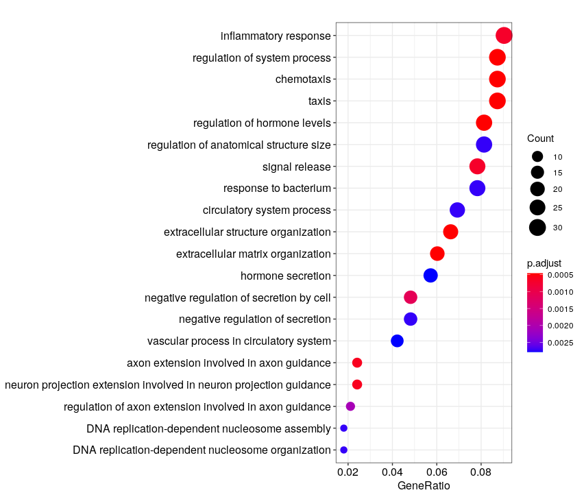
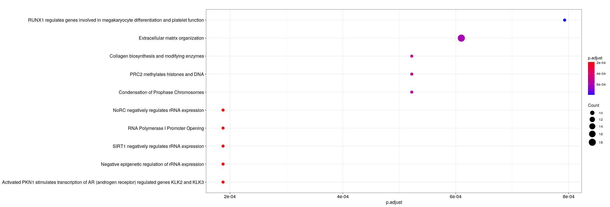

Once the reads have been mapped and counted, one can assess the differential expression of genes between different conditions.


**During this lesson, you will learn to :**

 * perform downstream analysis on gene sets, such as annotation (e.g. GO terms or Reactome pathways) over-representation.


## Material

<!-- [:fontawesome-solid-file-pdf: Download the presentation](../assets/pdf/RNA-Seq_07_Enrichment_analysis.pdf){target=_blank : .md-button } -->


<!-- [Rstudio website](https://www.rstudio.com/) -->

[clusterProfiler vignette/e-book](http://yulab-smu.top/clusterProfiler-book/)


## Downstream analysis : over-representation analysis

Having lists of differentially-expressed genes is quite interesting in itself,
however when there are many DE genes, it can be interesting to map these results 
onto curated sets of genes associated with known biological functions.

Here, we propose to use [clusterProfiler](https://bioconductor.org/packages/release/bioc/html/clusterProfiler.html),
which regroups several enrichment detection algorithms onto several databases.

We recommend you get inspiration from their very nice [vignette/e-book](http://yulab-smu.top/clusterProfiler-book/) to perform your own analyses.

<!-- If you do not have a list of DE genes from your previous analysis, you may use the following table:

[ :fontawesome-solid-file: Ruhland2016 DESeq2 results](../assets/txt/Ruhland2016.DESeq2.results.csv){target=_blank : .md-button } -->


<!-- TODO: Missing Rmd file in corrections -->

??? success "Ruhland2016 analysis with clusterProfiler"

	We continue directly from the DE analysis script, where the `master` object is already loaded.
	

	Translating gene ENSEMBL ids to their entrezID (this is what clusterProfiler uses), as well as Symbol (name used by most biologists).

	```R
	library(clusterProfiler)
	library(org.Mm.eg.db)

	allGenes <- master$Geneid

	genes_universe <- bitr(allGenes, fromType = "ENSEMBL",
	                       toType = c("ENTREZID", "SYMBOL"),
	                       OrgDb = "org.Mm.eg.db")
	head(genes_universe)

	sig <- master[master$padj < 0.05, ]
	sigGenes <- sig$Geneid

	genes_DE <- bitr(sigGenes, fromType = "ENSEMBL",
	                 toType = c("ENTREZID", "SYMBOL"),
	                 OrgDb = "org.Mm.eg.db")
	head(genes_DE)
	```

	```R
	# GO "biological process (BP)" enrichment
	ego_bp <- enrichGO(gene          = as.character(unique(genes_DE$ENTREZID)),
	                   universe      = as.character(unique(genes_universe$ENTREZID)),
	                   OrgDb         = org.Mm.eg.db,
	                   ont           = "BP",
	                   pAdjustMethod = "BH",
	                   pvalueCutoff  = 0.01,
	                   qvalueCutoff  = 0.05,
	                   readable      = TRUE)
	# takes a couple of minutes to run

	head(ego_bp)
	dotplot(ego_bp)
	# sample plot, but with adjusted p-value as x-axis
	#dotplot(ego_bp, x = "p.adjust", showCategory = 20)
	```
	<!--  -->


	```R
	library(ReactomePA)

	# Reactome pathways enrichment
	reactome.enrich <- enrichPathway(gene=as.character(unique(genes_DE$ENTREZID)),
	                                 organism = "mouse",
	                                 pAdjustMethod = "BH",
	                                 qvalueCutoff = 0.9,
	                                 readable=T,
	                                 universe = genes_universe$ENTREZID)
	# <1 minute to run

	dotplot(reactome.enrich, x = "p.adjust")
	```
	<!--  -->


