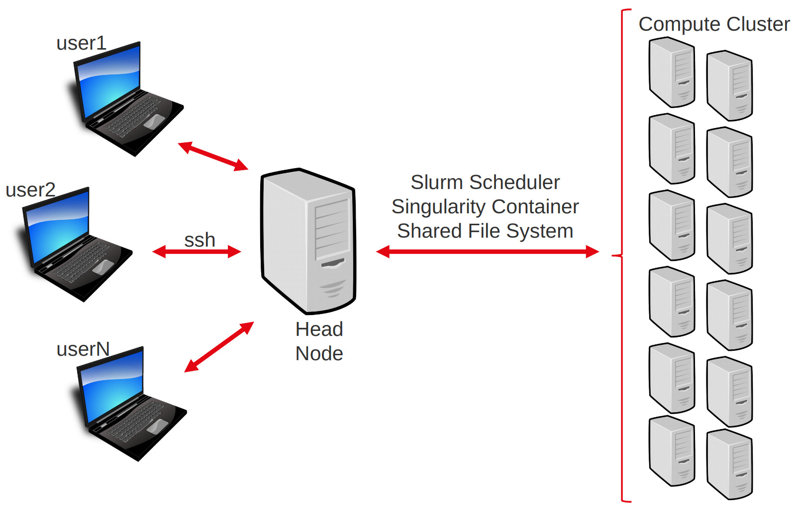
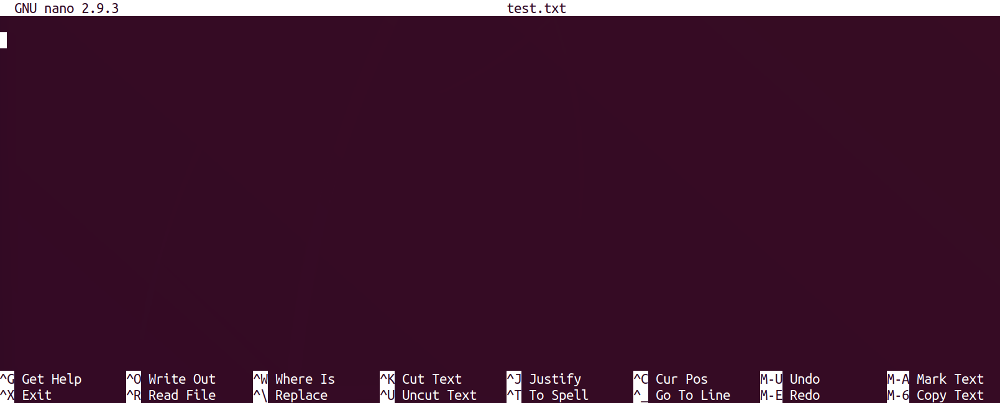

To conduct the practicals of this course, we will be using a dedicated High Performance Computing cluster. 
This matches the reality of most NGS workflows, which cannot be completed in a reasonable time on a single machine. 

To interact with this cluster, you will have to log in to a remote *head node*. From there you will be able to distribute your computational tasks to the cluster using a *job scheduler* called Slurm.

This page will cover our first contact with the remote cluster. 


**You will learn to :**

 * understand a typical computer cluster architecture.
 * connect to the server.
 * use the command line to perform basic operations on the head node.
 * exchange files between the server and your own machine.
 * submit a job to the cluster.


!!! note 
	If you are doing this course on your own, then the remote server provided within the course will not be available. 
	Feel free to ignore or adapt any of the following steps to your own situation.


## The computing cluster

The computing cluster follows an architecture that enables several users to distribute computational tasks among several machines which share a number of resources, such as a common file system.



Users do not access each machine individually, but rather connect to a **head node**. From there, they can interact with the cluster using the **job scheduler** (here slurm).
The job scheduler's role is to manage where and how to run the jobs of all users, such that waiting time is minimized and resource usage is shared and optimized.

!!! Warning
	Everyone is connected to the same head node. Do not perform compute-intensive tasks on it, or you will slow everyone down! 


## Connect to the server

Say you want to connect to cluster with address `xx.xx.xx.xx` and your login is `login`.


!!! Warning 
	If you are doing this course with a teacher, use the link, login and password provided before or during the course. 

The first step will be to open a **terminal**, a software that provides a command-line interface to a computer.

=== "Mac"
    
    Open a terminal, for instance with the application Xterm, Terminal, or Xquartz.

=== "Linux"
    
    Open a new terminal.

=== "Windows"
    
    Open the WSL shell or open PowerShell then launch WSL from within it

---

In the terminal, type the following command:

```sh
ssh netid@pronghorn.rc.unr.edu
```

When prompted for your password, type it and press Enter. 

!!! note

    There is no cursor or '●' character appearing while you type your password. This is normal. Deleting characters also works invisibly.


After a few seconds, you should be logged into the *head node* and ready to begin.


## Using command line on the cluster

Now that you are in the head node, it is time to get acquainted with your environment and to prepare the upcoming practicals. 
We will also use this as a short reminder about the UNIX command line.

Commands are issued using a shell command language. The one on our server is called bash. You can refer to this nice [Linux Command Line Cheat Sheet](https://cheatography.com/deleted-124743/cheat-sheets/linux-basic-commands/) (page 1 in particular) for reviewing common commands.


---

At any time, you can get the file system location (folder/directory) your terminal is currently in, by typing the "print working directory" command:

```sh
pwd
```

When you start a session on a remote computer, you are placed in your `home` directory. So the cluster should return something like:

```
/data/gpfs/home/$USER
```


From then, we are going to do a little step-by-step practical to go through some of bash's most useful commands for this course.

### Creating a directory

!!! example "practical"

    Use the command line to navigate to `/data/gpfs/assoc/biomarker_hunt/users` folder. Here you will create a personal folder and put all materials relating to the analysis of the mouseMT dataset.

??? success "Answer"
    ```sh
    cd /data/gpfs/assoc/biomarker_hunt/users
    ```


!!! example "practical"

    Use the command line to create a personal folder and create repository called `mouseMT` where you will put all materials relating to the analysis of the mouseMT dataset.

??? success "Answer"
    ```sh
    mkdir -p $USER/mouseMT
    ```

!!! example "practical"

    Move your terminal's connection to that directory.

??? success "Answer"
    ```sh
    cd $USER/mouseMT
    ```

The directory `/data/gpfs/assoc/biomarker_hunt/data/DATA/mouseMT` contains data for this workshop

!!! example "practical"

    List the content of the `/data/gpfs/assoc/biomarker_hunt/data/DATA/mouseMT` directory.

??? success "Answer"
    ```sh
    ls /data/gpfs/assoc/biomarker_hunt/data/DATA/mouseMT
    ```
    
!!! note
    You don't need to move to that directory to list its contents!
    

!!! example "practical"

    Copy the script `010_s_fastqc.sh` from  `/data/gpfs/assoc/biomarker_hunt/data/Solutions/mouseMT` into your current directory,
    and then print the content of this script to the screen.

??? success "Answer"
    ```sh
    cp /data/gpfs/assoc/biomarker_hunt/data/Solutions/mouseMT/010_s_fastqc.sh .
    less 010_s_fastqc.sh
    ```
    output:
    ```
    #!/usr/bin/bash
    #SBATCH --job-name=fastqc_mouseMT
    #SBATCH --time=01:00:00
    #SBATCH --cpus-per-task=1
    #SBATCH --mem=1G
    #SBATCH -o 010_l_fastqc_mouseMT.o
    #SBATCH --account=cpu-s5-biomarker_hunt-0
    #SBATCH --partition=cpu-core-0

    source activate rnaseq_env
    
     
    # creating the output folder
    mkdir -p 010_d_fastqc/
    
    fastqc -o 010_d_fastqc /data/gpfs/assoc/biomarker_hunt/data/DATA/mouseMT/*.fastq
    ```

We'll see what all this means soon.


### Creating and editing a file

To edit files on the remote server, we will use the command line editor `nano`. It is far from the most complete or efficient one, but it can be found on most servers, and is arguably among the easiest to start with.

!!! note
	Alternatively, feel free to use any other CLI editor you prefer, such as `vim` (my faveorite editor).

To start editing a file named `test.txt`, type :

```sh
	nano test.txt
```

You will be taken to the `nano` interface :



Type in your favorite movie quote, and then exit by pressing `Ctrl+x` (`command+x` on a Mac keyboard), and then `y` and `Enter` when prompted to save the modifications you just made.

You can check that your modifications were saved by typing

```sh
less test.txt
```

### Exchanging files with the server

Whether you want to transfer some data to the cluster or retrieve the results of your latest computation, it is important to be able to exchange files with the remote server.


There exists several alternatives, depending on your platform and preferences.


We will use `scp`.

To copy a file from the server to your machine, use this syntax on a **terminal in your local machine** (open a new terminal if necessary).

```sh
scp <login>@<server-adress>:/path/to/file/on/server/file.txt /local/destination/
```

For example, to copy the file `test.txt` you just created in the folder `mouseMT/`, to your current (local) working directory.
```sh
scp netid@pronghorn.rc.unr.edu:~/data/gpfs/assoc/biomarker_hunt/users/$USER/mouseMT/test.txt .
```	

To copy a file from your machine to the server:

```sh
scp /path/to/file/local/file.txt <login>@<server-adress>:/destination/on/server/
```

---

!!! example "practical"

    Retrieve the file `test.txt`, which you created in the previous practicals, from the remote server to your local machine. 

!!! example "practical"

    Create a text file on your local computer (using wordpad on windows, Text Edit on Mac, or gedit on linux). Save that file, and then send it to the remote server.


!!! Warning

    For **Windows users**, if you edit files on your computer before sending them to the server, you will likely see strange character at the end of the file lines.

    This is because Windows ends line with "\r\n" while Unix uses just "\n". This can be solved using the `dos2unix` command line tool:

    `dos2unix <filename>`


## CONDA Package Manager

Conda allows a user on a Unix system to install packages without sudo/admin privileges. Additionally, Conda allows users to create "environments" where a specific suite of programs are installed. A user can have as many environments as they want (i.e., for different projects and analyses types). This has the benefit of "freezing" your program versions so that your analyses are reproducible.

Imagine running an analysis, getting your final results, then 2 years later, your PI wants you to re-run the analysis with new samples. However, the programs you used were updated many times in the past years (bug fixes, new features, etc). Perhaps the output format has changed and now you can't compare the results of the new dataset with the old dataset. Using a Conda environment will allow you to recapitulate the original analysis for the new dataset.

### Installing Conda

In order to install Conda, we will need to download the program directly to our remote Linux computer, Pronghorn, or on your local workstation.

Visit this website here: [https://github.com/conda-forge/miniforge](https://github.com/conda-forge/miniforge).

If you scroll towards the bottom, you can see a list of Linux, OSX, and Windows installation options. We will use the one labeled "Linux X86_64". You can right-click and copy the link location from your browser, but I also provided the link below: [https://github.com/conda-forge/miniforge/releases/latest](https://github.com/conda-forge/miniforge/releases/latest).

!!! example "practical"

    Use wget to download the file to your directory. Then run the installation

??? success "Answer"
    ```sh
    wget https://github.com/conda-forge/miniforge/releases/download/26.3.2-3/Miniforge3-26.3.2-3-Linux-x86_64.sh
    bash Miniforge3-26.3.2-3-Linux-x86_64.sh
    ```
 
There will be some prompts about the installation which we will proceed through together. In order to scroll through the EULA agreement, use the space bar. 

!!! warning Reloading Configuration Required
    Once done, you will need to reload the .bashrc configuration to get your new conda installation working. You can either restart your terminal or reload your environment. Please do this now after installing conda by typing `exit`.

    Instead of logging completely out and back in by typing exit, you can tell the terminal to refresh its settings immediately. Use the source command on your bash profile:

    ```sh
    source ~/.bashrc
    ```

### Installing programs with Conda

Now that we have conda installed, let's install the tree command. This will install tree into your currently loaded environment, which the default is "base". 

```sh
conda install -c conda-forge tree htop
```

After installation try testing the `tree` and `htop` commands.


### Installing a named environment from a YAML file

You can also install programs using a YAML file which lists the programs to be installed. In the following case, we will be creating the conda environment named **rnaseq_env** with the software `fastqc`, `fastp`, `multiqc`, `star`, and `subread`.

!!! example "practical"

    Copy the file `/data/gpfs/assoc/biomarker_hunt/data/rnaseq_env.yaml` to your current folder

??? success "Answer"
    ```sh
    cp /data/gpfs/assoc/biomarker_hunt/data/rnaseq_env.yaml .
    ```

Now that we have the environment YAML file, let's inspect the file. Notice we list the programs we want to install. We can use conda to setup those programs.

`conda env create -f rnaseq_env.yaml`

After the install is completed, we can load the conda environment using:

`conda activate rnaseq_env`

Additionally, you can setup environments with specific versions for programs. This helps with ensuring reprodicibility of analyses at a later date, because you have kept track of the full software stack used for the analysis. Let's view file `/data/gpfs/assoc/biomarker_hunt/data/rnaseq_env_versioned.yaml`

Notice the version numbers listed next to the softwares. However, also notice the same environment name is listed at the top as our unversioned YAML. 

## bash scripts

So far we have been executing bash commands in the interactive shell.
This is the most common way of dealing with our data on the server for simple operations.

However, when you have to do some more complex tasks, such as what we will be doing with our RNA-seq data, you will want to use scripts. These are just normal text files which contain bash commands.

Scripts :

 * keep a written trace of your analysis, so they enhance its reproducibility. 
 * make it easier to correct something in an analysis (you don't have to retype the whole command, just change the part that is wrong).
 * often necessary when we want to submit big computing jobs to the cluster.


Create a new text file named `myScript.sh` on the server (you can use nano or create it on your local machine and later transfer it to the server). 

Then, type this into the file:

```sh
#!/usr/bin/bash    

## this is a comment, here to document this script
## whatever is after # is not interpreted as code.

# the echo command prints whatever text follows to the screen: 
echo "looking at the size of the elements of /data/gpfs/assoc/biomarker_hunt/data"

sleep 15 # making the script wait for 15 seconds - this is just so we can see it later on. 

# du : "disk usage", a command that returns the size of a folder structure.
du -h -d 2 /data/gpfs/assoc/biomarker_hunt/data
```

The first line is not 100% necessary at this step, but it will be in the next part, so we might as well put it in now. It helps some software know that this file contains bash code. 

Then to execute the script, navigate **in a terminal open on the server** to the place where the script is, and execute the following command:

```sh
bash myScript.sh
```

!!! warning
    Be sure to execute the script from the folder that it is in. Otherwise you would have to specify in which folder to find the script using its path.

This should have printed some information about the size of `/data/gpfs/assoc/biomarker_hunt/data` subfolders to the screen.


## Submitting jobs

### Submitting a simple script

Jobs can be submitted to the compute cluster using **bash scripts**, with an optional little preamble which tells the cluster about your computing resource requirements, and a few additional options.

Each time a user submits a job to the cluster, SLURM checks how much resources they asked for, with respect to the amount available right now in the cluster and how much resources are allowed for that user. 

If there are enough resources available, then it will launch the job on one or several of its worker nodes. If not, then it will wait for the required resources to become available, and then launch the job.


To start with, you can have a look at what is happening right now in the cluster with the command:

```sh
squeue
```

On the small course server, there should not be much (if anything), but on a normal cluster you would see something like:


```sh
(samtools) [hvasquezgross@login-0 data]$ squeue
             JOBID PARTITION     NAME     USER ST       TIME  NODES NODELIST(REASON)
           5664823 cpu-core-  chip_qc clegenba PD       0:00      1 (DependencyNeverSatisfied)
           5668084 cpu-core- pick_bes stevench PD       0:00      1 (Dependency)
           5668083 cpu-core- filter_t stevench PD       0:00      1 (DependencyNeverSatisfied)
     6085253_[1-5] cpu-s2-co ray-xgb-   sfrese PD       0:00      3 (Resources)
           6085244 cpu-s2-co FAg2I26r  marcust PD       0:00      1 (Priority)
           6085245 cpu-s2-co FAg3Cl26  marcust PD       0:00      1 (Priority)
           6085246 cpu-s2-co FAg3Cl26  marcust PD       0:00      1 (Priority)
           6085217 cpu-s2-co airfoilR smirafza  R   17:37:08      1 cpu-44
           6085229 cpu-s2-co     aimd   leicao  R   13:34:54      1 cpu-36
           6085228 cpu-s2-co     aimd   leicao  R   13:47:03      1 cpu-41
           6085227 cpu-s2-co     aimd   leicao  R   14:27:05      1 cpu-20
                               
```

The columns correspond to :

 * JOBID : the job id, which is the number that SLURM uses to identify any job
 * PARTITION : which part of the cluster is that job executing at
 * NAME : the name of the job
 * USER : which user submitted the job
 * STATE : whether the job is currently `RUNNING`, `PENDING`, `COMPLETED`, `FAILED`
 * TIME : how long has this job been running for
 * TIME_LIMIT : how long will the job be allowed to run
 * QOS : which queue of the cluster does the job belong to. Queues are a way to organize jobs in different categories of resource usage.
 * NODELIST(REASON) : which worker node(s) is the job running on.

You can look up more info on [squeue documentation](https://curc.readthedocs.io/en/latest/running-jobs/squeue-status-codes.html).


Now, you will you will want to execute your `myScript.sh` script as a job on the cluster.

This can be done with the `sbatch` command.

The script can stay the same (for now), but there is an important aspect of `sbatch` we want to handle: the **script will not be executing in our terminal directly, but on a worker node**.

That means that there is no screen to print to. So, in order to still be able to view the output of the script, SLURM will write the printed output into a file which we will be able to read when the job is finished (with `more` or `less`).
By default, SLURM will name this file something like `slurm-<jobid>.out`, which is not very informative to us; so, instead of keeping the default, we will give our own output file name to `sbatch` with the option `-o`. For example, I will name it `myOutput.o`.

We will also need to specify the account and partition so SLURM knows which queue to put our jobs in. For this workshop, it should be `--account=cpu-s5-biomarker_hunt-0` and `--partition=cpu-core-0`. 


In the terminal, navigate to where you have you `myScript.sh` file on the remote server and type

```sh
sbatch -o myOutput.o --account=cpu-s5-biomarker_hunt-0 --partition=cpu-core-0 myScript.sh
```

You should see an output like:

```sh
sbatch: Submitted batch job 41
```

Letting you know that your job has the jobid 41 (surely yours will be different).

Directly after this, quickly type:

```sh
squeue
```

If you were fast enough, then you will see your script `PENDING` or `RUNNING`.

If not, then that means that your script has finished running. You do not know yet if it succeeded or failed.
To check this, you need to have a look at the output file, `myOutput.o` in our case.

If everything worked, you will see the normal output of your script. 
Otherwis, you will see some error messages.


### Specifying resources needed to SLURM

When submitting the previous job, we did not specify our resource requirements to SLURM, which means that SLURM assigned it the default:

 * 1 hour
 * 1 CPU
 * 1 GB of RAM

Often, we will want something different from that, and so we will use options in order to specify what we need.

For example:

 * `--time=00:30:00` : time reserved for the job : 30min. 
 * `--mem=2G` : memory for the job: 2GB
 * `--cpus-per-task=4` : 4 CPUs for the job 

Your `sbatch` command line will quickly grow to be long and unwieldy. It can also be difficult to remember exactly how much RAM and time we need for each script.

To address this, SLURM provides a fairly simple way to add this information to the scripts themselves, by adding lines starting with `#SBATCH` after the first line.

For our example, it could look like this:

```sh
#!/usr/bin/bash
#SBATCH --job-name=test
#SBATCH --time=00:30:00
#SBATCH --cpus-per-task=4
#SBATCH --mem=2G
#SBATCH -o test_log.o
#SBATCH --account=cpu-s5-biomarker_hunt-0
#SBATCH --partition=cpu-core-0


echo "looking at the size of the elements of /data/gpfs/assoc/biomarker_hunt/data"
sleep 15 # making the script wait for 15 seconds - this is just so we can see it later on. 
# `du` is "disk usage", a command that returns the size of a folder structure.
du -h -d 2 /data/gpfs/assoc/biomarker_hunt/data

```


I also added the following options :

 * `#SBATCH --job-name=test` : the job name
 * `#SBATCH -o test_log.o` : file to write output or error messages

We would then submit the script with a simple `sbatch myScript.sh` without additional options.

!!! example practical
    Create a new file named `mySbatchScript.sh`, copy the code above into it, save, then submit this file to the job scheduler using the following command :

	```sh
		sbatch mySbatchScript.sh
	```

	Use the command `squeue` to monitor the jobs submitted to the cluster. 

	Check the output of your job in the output file `test_log.o`.

!!! note 
	When there are a lot of jobs, `squeue -u <username>` will limit the list to those of the specified user.


### Advanced cluster usage : job array 

Often, we have to repeat a similar analysis on a number of files, or for a number of different parameters.
Rather than writing each sbatch script individually, we can rely on **job arrays** to facilitate our task.

The idea is to have a single script which will execute itself several times.
Each of these executions is called a **task**, and they are all the same, save for one variable which whose value changes from 1 to the number of tasks in the array.

We typically use this variable, named `$SLURM_ARRAY_TASK_ID` to fetch different lines of a file containing information on the different tasks we want to run (in general, different input file names).


!!! note

    In bash, we use variables to store information, such as a file name or parameter value.

    Variables can be created with a statement such as:

    ```myVar=10```

    where variable `myVar` now stores the value 10.

    The variable content can then be accessed with:

    ```${myVar}```

    You do not really need more to understand what follows, but if you are curious, you can consult [this small tutorial](https://ryanstutorials.net/bash-scripting-tutorial/bash-variables.php#setting).

---

Say you want to execute a command, on 10 files (for example, map the reads of 10 samples).

You first create a file containing the name of your files (one per line); let's call it `readFiles.txt`.

```sh
/data/gpfs/assoc/biomarker_hunt/data/DATA/mouseMT/sample_a1.fastq
/data/gpfs/assoc/biomarker_hunt/data/DATA/mouseMT/sample_a2.fastq
/data/gpfs/assoc/biomarker_hunt/data/DATA/mouseMT/sample_a3.fastq
/data/gpfs/assoc/biomarker_hunt/data/DATA/mouseMT/sample_a4.fastq
/data/gpfs/assoc/biomarker_hunt/data/DATA/mouseMT/sample_b1.fastq
/data/gpfs/assoc/biomarker_hunt/data/DATA/mouseMT/sample_b2.fastq
/data/gpfs/assoc/biomarker_hunt/data/DATA/mouseMT/sample_b3.fastq
/data/gpfs/assoc/biomarker_hunt/data/DATA/mouseMT/sample_b4.fastq
```

Then, can create an sbatch array script named `sbatchArray.sh` with the following contents.

```sh
#!/usr/bin/bash
#SBATCH --job-name=test_array
#SBATCH --time=00:30:00
#SBATCH --cpus-per-task=1
#SBATCH --mem=1G
#SBATCH -o test_array_log.%a.o
#SBATCH --array 1-10%5
#SBATCH --account=cpu-s5-biomarker_hunt-0
#SBATCH --partition=cpu-core-0


echo "job array id" $SLURM_ARRAY_TASK_ID

# sed -n <X>p <file> : retrieve line <X> of file
# so the next line grabs the file name corresponding to our job array task id and stores it in the variable ReadFileName 
ReadFileName=`sed -n ${SLURM_ARRAY_TASK_ID}p readFiles.txt`

# here we would put the mapping command or whatever
echo $ReadFileName

sleep 15

```

Some things have changed compared to the previous sbatch script :

 * `#SBATCH --array 1-10%5` : will spawn independent tasks with IDs from 1 to 10, and will manage them so that at most 5 run at the same time.
 * `#SBATCH -o test_array_log.%a.o` : the `%a` will take the value of the array task ID. So we will have 1 log file per task (so 10 files).
 * `$SLURM_ARRAY_TASK_ID` : changes value between the different tasks. This is what we use to execute the same script on different files (using `sed -n ${SLURM_ARRAY_TASK_ID}p`)


Furthermore, this script uses the concept of bash variable.

Many things could be said on that, but I will keep it simple with this little demo code:

```sh
foo=123                # Initialize variable foo with 123
                       #   !warning! it will not work if you put spaces in there

# we can then access this variable content by putting a $ sign in front of it:

echo $foo              # Print variable foo, sensitive to special characters
echo ${foo}            # Another way to print variable foo, not sensitive to special characters

OUTPUT=`wc -l du -h -d 2 /data/gpfs/assoc/biomarker_hunt/data` # puts the result of the command 
                                        #   between `` in variable OUTPUT

echo $OUTPUT           # print variable output
```

So now, this should help you understand the trick we use in the array script:

```sh
ReadFileName=`sed -n ${SLURM_ARRAY_TASK_ID}p readFiles.txt`
```

Where, for example for task 3, `${SLURM_ARRAY_TASK_ID}` is equal to 3.

We feed this to `sed`, so that it grabs the 3rd line of `readFiles.txt`, and we put that value into the `ReadFileName`.


!!! example "practical"

    Let's try submitting the array job now.

??? success "Answer"
    ```sh
    sbatch sbatchArray.sh
    ```

